# University-Management Architecture

A loosely coupled, event-driven microservices architecture implementing Saga pattern for distributed transactions.

## Architecture Overview

### Multi-Tenancy
- **Database per Service**: Each microservice owns its dedicated PostgreSQL instance for true data isolation

### Communication Patterns
- **API Gateway**: Single entry point (Spring Cloud Gateway)
- **Synchronous**: HTTP/REST for queries only (CQRS - Query side)
- **Asynchronous**: RabbitMQ for all commands and inter-service communication
- **Caching**: Redis for sessions, JWT blacklist, and rate limiting

### Authentication & Security
- JWT authentication via Auth Service
- JWT validation at API Gateway (per request)
- RBAC enforcement per operation
- Audit logging for sensitive operations

### Failure Handling
- Circuit Breakers (Resilience4j)
- Retry logic with exponential backoff
- Dead letter queues for failed messages

---

## Service Inventory

| Service | Port | Framework | Database | Description |
|---------|------|-----------|----------|-------------|
| API Gateway | 8080 | Java 25 / Spring Cloud Gateway | - | Entry point, routing, JWT validation, rate limiting |
| Auth Service | 8081 | Java 25 / Spring Boot | PostgreSQL (5432) | User authentication, JWT generation |
| User Service | 8082 | Java 25 / Spring Boot | PostgreSQL (5433) | User profiles, RBAC |
| Resource Service | 8083 | Java 25 / Spring Boot | PostgreSQL (5434) | Resource catalog, availability |
| Booking Service | 8084 | Java 25 / Spring Boot | PostgreSQL (5435) | Reservations, overbooking prevention |
| Marketplace Service | 8085 | Java 25 / Spring Boot | PostgreSQL (5436) | Products, orders, **Saga Orchestrator** |
| Payment Service | 8086 | Java 25 / Spring Boot | PostgreSQL (5437) | Payment processing, Saga participant |
| Exam Service | 8087 | Java 25 / Spring Boot | PostgreSQL (5438) | Exams, submissions, Circuit Breaker |
| Notification Service | 8088 | Java 25 / Spring Boot | PostgreSQL (5439) | Email/SMS, Observer pattern |
| IoT Service | 8089 | Java 25 / Spring Boot | TimescaleDB (5441) | Sensor data, time-series analytics |
| Tracking Service | 8090 | Java 25 / Spring Boot | PostgreSQL (5440) | Shuttle GPS tracking |

### Infrastructure Services

| Service | Port(s) | Description |
|---------|---------|-------------|
| RabbitMQ | 5672, 15672 | Message broker, Saga orchestration, event-driven messaging |
| Redis | 6379 | Caching, session storage, rate limiting |

---

## Level 2 C4 diagram

```mermaid
---
config:
  theme: dark
---
flowchart TB
 subgraph CoreServices["Core Microservices"]
        AuthService["🔐 Auth Service<br>Port 8081<br><br>JWT authentication<br>User management"]
        UserService["👤 User Service<br>Port 8082<br><br>User profiles<br>RBAC management"]
        ResourceService["📚 Resource Service<br>Port 8083<br><br>Resource catalog<br>Availability check"]
        BookingService["📅 Booking Service<br>Port 8084<br><br>Reservations<br>Overbooking prevention"]
  end
 subgraph BusinessServices["Business Microservices"]
        MarketplaceService["🛒 Marketplace Service<br>Port 8085<br><br>Products & Orders<br>SAGA ORCHESTRATOR"]
        PaymentService["💰 Payment Service<br>Port 8086<br><br>Payment processing<br>Saga participant"]
        ExamService["📝 Exam Service<br>Port 8087<br><br>Exams & Submissions<br>CIRCUIT BREAKER"]
  end
 subgraph SupportServices["Support Microservices"]
        NotificationService["📬 Notification Service<br>Port 8088<br><br>Email & SMS<br>Observer Pattern"]
        IoTService["🌡️ IoT Service<br>Port 8089<br><br>Sensor data processing<br>Time-series analytics"]
        TrackingService["🚌 Tracking Service<br>Port 8090<br><br>Shuttle GPS tracking<br>Real-time location"]
  end
 subgraph DataStores["Data Storage Layer - Database per Service"]
        AuthDB["🗄️ Auth DB<br>PostgreSQL:5432"]
        UserDB["🗄️ User DB<br>PostgreSQL:5433"]
        ResourceDB["🗄️ Resource DB<br>PostgreSQL:5434"]
        BookingDB["🗄️ Booking DB<br>PostgreSQL:5435"]
        MarketplaceDB["🗄️ Marketplace DB<br>PostgreSQL:5436"]
        PaymentDB["🗄️ Payment DB<br>PostgreSQL:5437"]
        ExamDB["🗄️ Exam DB<br>PostgreSQL:5438"]
        NotificationDB["🗄️ Notification DB<br>PostgreSQL:5439"]
        TrackingDB["🗄️ Tracking DB<br>PostgreSQL:5440"]
        TimescaleDB["⏱️ TimescaleDB:5441<br>IoT sensor data"]
        Redis["⚡ Redis Cache<br>Port 6379"]
  end

    WebApp["🌐 Web App<br>student/instructor"] -- HTTPS/REST --> APIGateway["🚪 API Gateway<br>Spring Cloud Gateway<br>Port 8080"]
    
    APIGateway -- "HTTP/REST<br>(Queries)" --> AuthService
    APIGateway -- "HTTP/REST<br>(Queries)" --> ResourceService
    APIGateway -- "HTTP/REST<br>(Queries)" --> TrackingService
    APIGateway -- "Publish Commands" --> MessageBroker
    
    AuthService -- JDBC --> AuthDB
    UserService -- JDBC --> UserDB
    ResourceService -- JDBC --> ResourceDB
    BookingService -- JDBC --> BookingDB
    MarketplaceService -- JDBC --> MarketplaceDB
    PaymentService -- JDBC --> PaymentDB
    ExamService -- JDBC --> ExamDB
    NotificationService -- JDBC --> NotificationDB
    TrackingService -- JDBC --> TrackingDB
    IoTService -- JDBC --> TimescaleDB

    MessageBroker["🐰 RabbitMQ<br>Ports 5672, 15672<br><br>Event-driven messaging<br>Saga orchestration"]
    
    AuthService <-- AMQP --> MessageBroker
    UserService <-- AMQP --> MessageBroker
    ResourceService <-- AMQP --> MessageBroker
    BookingService <-- AMQP --> MessageBroker
    MarketplaceService <-- "AMQP<br>Saga Events" --> MessageBroker
    PaymentService <-- "AMQP<br>Saga Events" --> MessageBroker
    ExamService <-- AMQP --> MessageBroker
    NotificationService -- "AMQP<br>Consume" --> MessageBroker
    IoTService <-- AMQP --> MessageBroker
    TrackingService <-- AMQP --> MessageBroker

    AuthService -- Cache tokens --> Redis
    BookingService -- Cache availability --> Redis
    APIGateway -- Rate limiting --> Redis

    style MarketplaceService fill:#2a9d8f,stroke:#1a6d5f,stroke-width:2px,color:#ffffff
    style ExamService fill:#e76f51,stroke:#b74c2f,stroke-width:2px,color:#ffffff
    style Redis fill:#dc143c,stroke:#a00000,stroke-width:3px,color:#ffffff
    style APIGateway fill:#1168bd,stroke:#0b4884,stroke-width:3px,color:#ffffff
    style MessageBroker fill:#ff6b6b,stroke:#cc5555,stroke-width:3px,color:#ffffff
```

---

## Design Patterns

| Pattern | Implementation | Service(s) |
|---------|---------------|------------|
| **Saga** | Choreography via RabbitMQ | Marketplace, Payment, Booking |
| **CQRS** | Queries via REST, Commands via MQ | All services |
| **Circuit Breaker** | Resilience4j | Exam → Notification |
| **Database per Service** | Isolated PostgreSQL instances | All services |
| **Observer** | Event-driven notifications | Notification Service |
| **Strategy** | Payment method selection | Payment Service |
